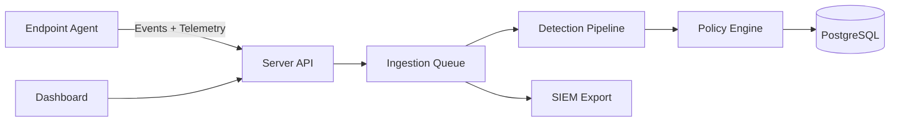

# DLP Platform — Enterprise Data Loss Prevention

Production-grade DLP platform with endpoint enforcement, multi-tenant server control plane, and an investigation dashboard. This repository is organized as a clean monorepo with explicit domain boundaries for agent, server, and dashboard capabilities.

## Architecture diagram


## Repository layout
```
/agent
/server
/dashboard
/rules
/deploy
/scripts
/docs
/tests
```

## Core components
- **Agent**: Windows service with USB/file monitoring, policy enforcement, anti-tamper, telemetry, and local SQLite storage.
- **Server**: FastAPI control plane with ingestion queue, detection + policy evaluation, RBAC, licensing, SIEM export, and metrics.
- **Dashboard**: Investigation and policy UI for operators.

## Quick start (local)
1. Copy `server/.env.example` to `.env` and set required `DLP_` variables.
2. Launch the stack:
   ```bash
   docker compose -f deploy/docker/docker-compose.yml up -d --build
   ```
3. Run migrations:
   ```bash
   docker compose -f deploy/docker/docker-compose.yml run --rm server \
     alembic -c server/alembic.ini upgrade head
   ```

## Production deploy
Follow the production steps in `docs/deployment_guide.md`, including TLS setup and license validation.

## Agent deploy
1. Build the agent:
   ```bash
   make agent-build
   ```
2. Place `agent/config/agent_config.json` and signed policy assets on the endpoint.
3. Configure the server endpoint and HMAC keys in the agent config.

## Policy guide
Rule packs live in `/rules` and are covered in `docs/policy_guide.md`.

## Documentation
- Architecture: `docs/architecture.md`
- Threat model: `docs/threat_model.md`
- Admin guide: `docs/admin_guide.md`
- Deployment guide: `docs/deployment_guide.md`
- Policy guide: `docs/policy_guide.md`
- Incident response: `docs/incident_response.md`
- Enterprise augmentations: `docs/enterprise_augmentations.md`

## Development
Common tasks:
```bash
make agent-build
make server-run
make migrate
make test
```
