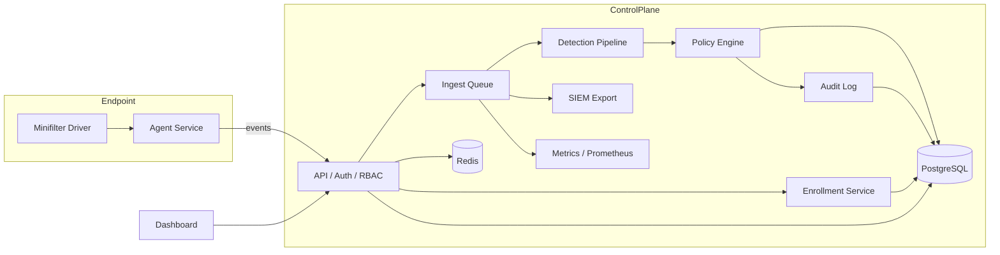

# Architecture

## Platform overview
The DLP platform is a production-grade, multi-tenant system composed of:
- **Agent**: Windows endpoint sensor and enforcement service, with telemetry spooling, policy signing, and replay defense.
- **Server**: API, ingestion queue, detection and policy evaluation, licensing, RBAC, SIEM export, and metrics.
- **Dashboard**: Operator console for policy, investigation, and risk workflows.

## Component diagram

## Module boundaries
### Server domains
- **api**: HTTP routes, auth, and external integration contracts.
- **ingest**: Queueing and enrichment of agent events.
- **detection**: Content and signal analysis (entropy, archive scanning, etc.).
- **policy**: Rule loading, policy evaluation, enforcement decisions.
- **security**: Replay defense, signing/HMAC, JWT validation, CSRF, and rate limiting.
- **rbac**: Role-based access control decisions.
- **license**: License validation gate.
- **siem**: Syslog/SIEM export adapters.
- **metrics**: Prometheus counters/gauges and metric points for telemetry aggregation.
- **audit**: Immutable audit log entries for security-critical actions.

### Agent domains
- **config**: Signed local configuration and rule pack selection.
- **enterprise**: Anti-tamper, telemetry, advanced rule engine, policy fetcher.
- **drivers**: Kernel-level driver assets (minifilter).

## Dependency graph notes
- API routes depend on **security**, **models**, and **schemas** only.
- Ingest depends on **policy**, **detection**, **siem**, **metrics**, and **models**.
- Policy depends only on **models** and **rule_loader** inputs (no IO).
- Security depends on **config** and storage adapters (Redis).
- License and RBAC are leaf modules; dependents call them but they do not depend on other domains.
- Metrics and SIEM are leaf adapters; ingestion calls them after decisioning.
